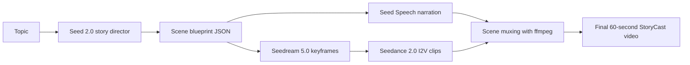

# StoryCast

[](https://github.com/Rohan5commit/storycast-seed-agents/actions/workflows/ci.yml)

StoryCast is an autonomous multimodal storytelling agent built for the Beta University AI Lab: Seed Agents Challenge. Give it a single topic such as `the death of a star`, and it turns that idea into a narrated, visual 60-second short film using the BytePlus Seed stack end to end.

The project is intentionally shaped for the current judging rubric: strong video output, obvious agentic execution, and a demo flow that is easy to show live.

## Why This Fits The Challenge

- `Seed 2.0` writes a structured six-scene story blueprint with narration, visual prompts, motion prompts, and tone metadata.
- `Seedream 5.0` generates one keyframe per scene, turning the blueprint into a storyboard.
- `Seed Speech` synthesizes voiceover for every scene.
- `Seedance 2.0` animates each keyframe in image-to-video mode.
- `ffmpeg` stitches the clips together and muxes scene audio into a final film.
- A FastAPI web app gives you a clean demo surface for judges, and a CLI gives you a dead-simple fallback.

## Product Flow



## Quick Start

1. Create a virtual environment and install dependencies.
2. Add your BytePlus credentials in `.env` or exported environment variables.
3. Run the CLI or web app.

```bash
python3 -m venv .venv
source .venv/bin/activate
pip install -e ".[dev]"
cp .env.example .env
storycast create --topic "the death of a star"
```

To launch the demo UI:

```bash
storycast serve --reload
```

The web app starts on `http://127.0.0.1:8000` by default.

## Configuration

Core settings live in `.env.example`.

- `ARK_API_KEY`: ModelArk API key for Seed 2.0, Seedream 5.0, and Seedance 2.0.
- `SEED_STORY_MODEL`: Defaults to `seed-2-0-pro-260328`.
- `SEEDREAM_MODEL`: Defaults to `seedream-5-0-260128`.
- `SEEDANCE_MODEL`: Defaults to `dreamina-seedance-2-0-260128`.
- `BYTEPLUS_TTS_APP_ID`, `BYTEPLUS_TTS_TOKEN`, `BYTEPLUS_TTS_CLUSTER`: Seed Speech credentials.
- `BYTEPLUS_TTS_VOICE_TYPE`: Narrator voice selection.

See [docs/byteplus-setup.md](docs/byteplus-setup.md) for the exact model IDs, endpoints, and docs links used to wire the stack.

## Demo Surfaces

- `storycast create --topic "..."`: Runs the full pipeline from the terminal.
- `storycast serve`: Starts the FastAPI app with a launch-ready interface for judges.
- `GET /health`: Lightweight status endpoint.
- `POST /api/storycasts`: Creates a StoryCast job.
- `GET /api/storycasts/{job_id}`: Polls job status and returns the generated manifest.

## Repo Structure

```text
.
├── .github/workflows/ci.yml
├── .env.example
├── Dockerfile
├── Makefile
├── README.md
├── docs/
│   ├── architecture.md
│   ├── byteplus-setup.md
│   ├── demo-script.md
│   └── submission-checklist.md
├── main.py
├── pyproject.toml
├── storycast/
│   ├── api.py
│   ├── cli.py
│   ├── config.py
│   ├── ffmpeg.py
│   ├── models.py
│   ├── pipeline.py
│   ├── prompting.py
│   ├── utils.py
│   ├── clients/
│   │   ├── modelark.py
│   │   └── seed_speech.py
│   └── web/
│       ├── static/
│       └── templates/
└── tests/
    ├── test_ffmpeg.py
    ├── test_models.py
    └── test_utils.py
```

## Docs For The Submission

- [Architecture](docs/architecture.md)
- [BytePlus Setup](docs/byteplus-setup.md)
- [2-Minute Demo Script](docs/demo-script.md)
- [Submission Checklist](docs/submission-checklist.md)

## Notes On Challenge Positioning

As of April 16, 2026, the public challenge page shows four challenge areas plus six track-winner specialty prizes. This repo positions StoryCast as a creative multimodal entry that still clearly demonstrates video-agent behavior and full BytePlus Seed usage.

## References

- Beta University challenge page: https://www.betahacks.org/
- BytePlus ModelArk quick start: https://docs.byteplus.com/en/docs/ModelArk/1399008
- BytePlus Model list: https://docs.byteplus.com/en/docs/ModelArk/1330310
- BytePlus pricing: https://docs.byteplus.com/docs/ModelArk/1099320
- Seed Speech TTS overview: https://docs.byteplus.com/api/docs/byteplusvoice/TTS_Product_Overview
- BytePlus Speech TTS HTTP API: https://docs.byteplus.com/zh-CN/docs/speech/docs-http-api
- BytePlus Speech basic parameters: https://docs.byteplus.com/en/docs/speech/docs-request-parameters-2
- Supported Seed Speech voices: https://docs.byteplus.com/en/docs/speech/docs-voice-parameters-1
- Seedance prompt guide sample: https://docs.byteplus.com/en/docs/ModelArk/1631633
