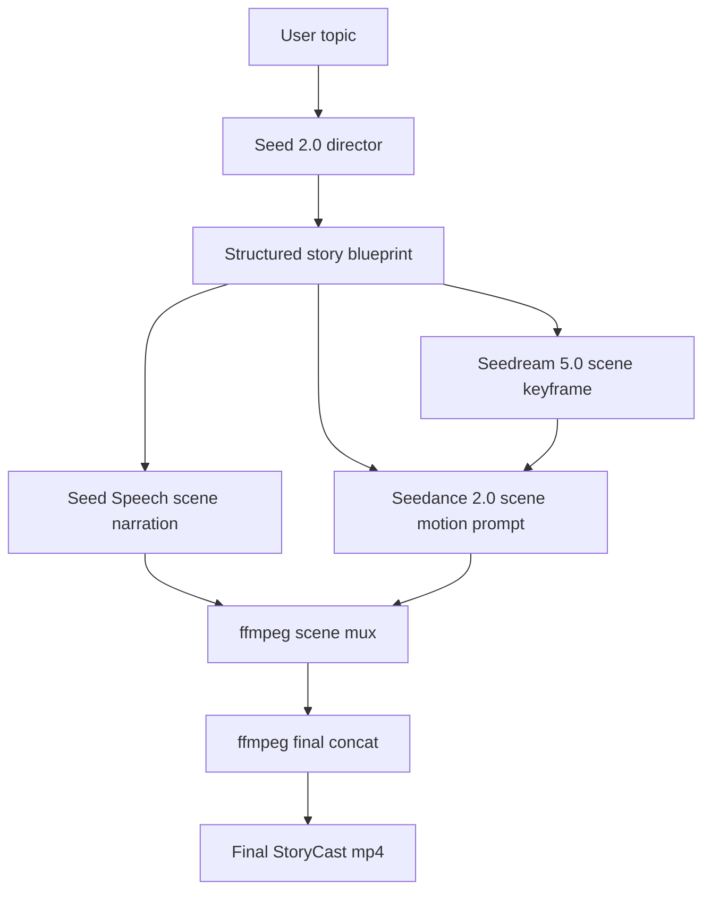

# Architecture

StoryCast is deliberately opinionated: one user topic in, one pitch-ready short film out.

## System Diagram

## Runtime Contract

Every run produces a directory under `runs/<timestamp>-<topic-slug>/`.

Each scene emits four artifacts:

- `scene_XX.png`: Seedream keyframe.
- `scene_XX.mp3`: Seed Speech narration.
- `scene_XX.mp4`: raw Seedance clip.
- `scene_XX_muxed.mp4`: scene clip with audio.

The run also emits:

- `blueprint.json`: Seed 2.0 story plan.
- `manifest.json`: run metadata, scene assets, and final output path.
- `storycast_final.mp4`: stitched deliverable.

## Why The Architecture Scores Well

- The agent work is explicit. Judges can see orchestration, not just generation.
- Every BytePlus Seed tool has a visible role in the pipeline.
- The manifest makes the system explainable during a live demo.
- Scene-level artifacts allow iterative debugging if one clip is weak.

## Defaults Chosen For Demo Quality

- `seed-2-0-pro-260328` for stronger scene planning and tighter narrative structure.
- `seedream-5-0-260128` for richer storyboard panels.
- `dreamina-seedance-2-0-260128` for flagship clip quality.
- `720p` output to stay cost-aware while preserving a polished look.

Switch the model IDs in `.env` if you want a faster iteration loop during rehearsal.
